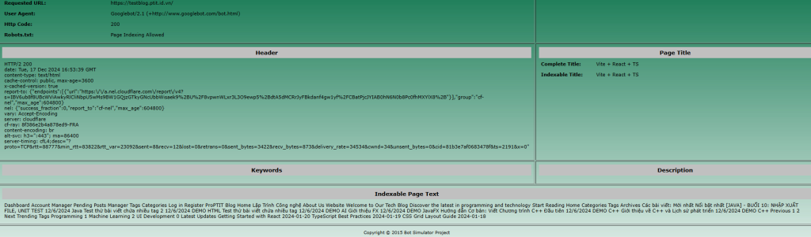
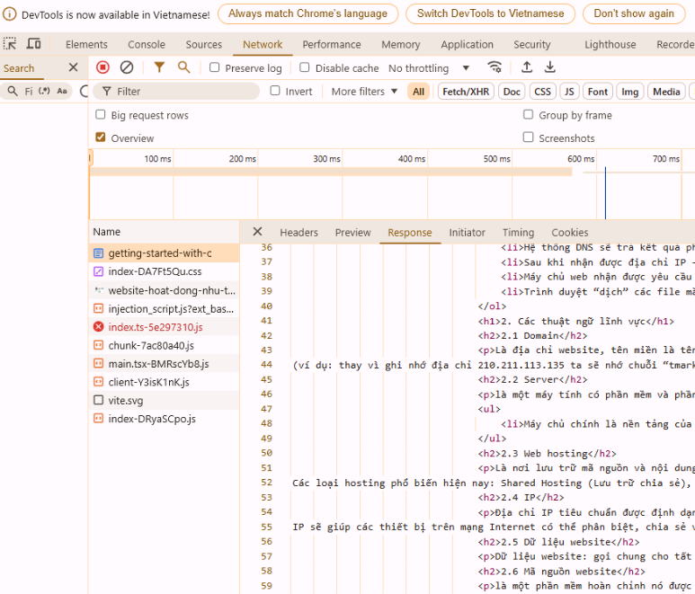
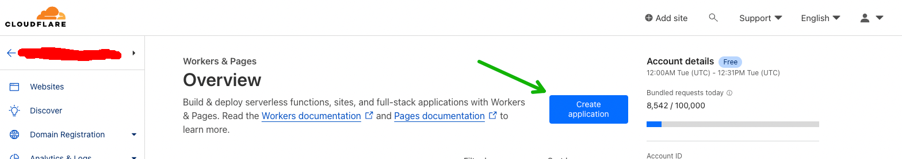
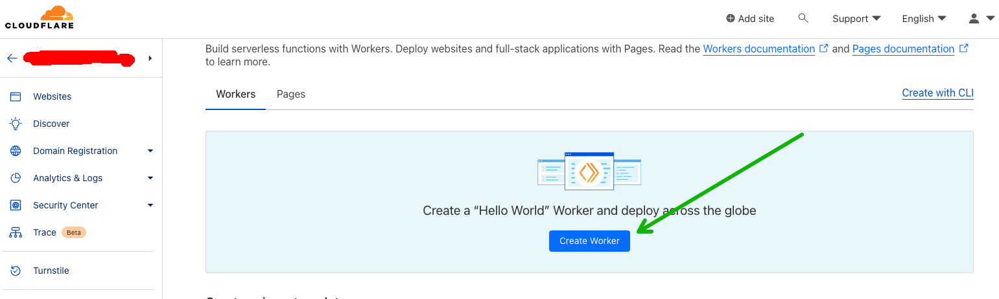
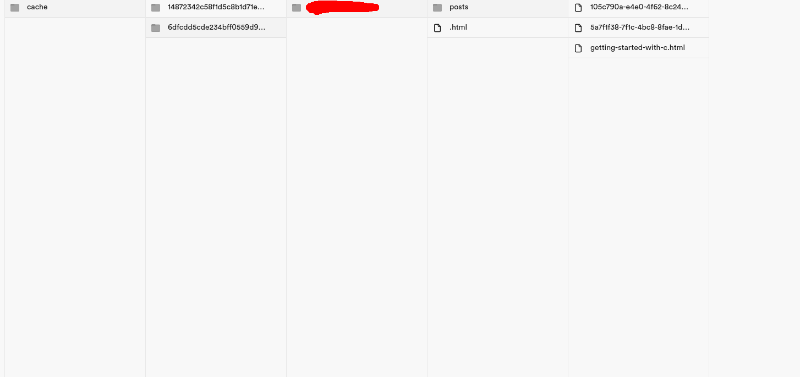

# CSR SEO Page Crawler

A solution for building SEO-friendly Client-Side Rendered (CSR) blogs with dynamic content management capabilities, all while maintaining a zero-cost infrastructure.

## Problem Statement
Building a blog platform with three key requirements:
- Dynamic content management through a user-friendly interface
- Zero infrastructure costs (excluding domain)
- SEO optimization

## Detailed Architecture Implementation
For a comprehensive understanding of the implementation and architecture, read the full blog post here: https://quochung.cyou/toi-uu-seo-website-csr-react-angular-bang-ki-thuat-precrawl/


## Solution
This project implements a pre-crawling strategy that combines the best of both worlds:
- CSR for regular users: Fast, dynamic content loading via API
- Pre-rendered static HTML for search engine bots: Optimal SEO performance


## Demo

### React Site without Pre-Crawling


### React Site with Pre-Crawling





## Project Structure

```
project/
├── cloudflare-worker/        # Bot detection and routing
│   ├── src/
│   │   └── index.ts         # Main worker logic
│   ├── package.json         # Dependencies
│   └── wrangler.toml        # Worker configuration
├── src/                     # Main application code (scraper.ts, webScraper.ts)
└── README.md
```

## Technical Implementation

### 1. Bot Detection & Routing
- Intelligent user-agent detection for major search engines and social media bots
- Separate handling for media files (images, videos, etc.)
- Automatic routing of bot requests to pre-rendered HTML
- Human visitors get the full CSR experience

### 2. Caching Strategy
- Pre-rendered HTML stored in Supabase Storage
- Site identification using MD5 hashing
- Configurable cache duration
- Fallback mechanisms for cache misses

### 3. Infrastructure Components
- **Proxy Layer**: Cloudflare Worker Route + Worker for bot detection and routing
- **Storage**: Supabase Storage for HTML caching
- **Frontend**: React-based static site hosted on Cloudflare Pages
- **Crawler**: Automated crawling via GitHub Actions
- **Backend**: Supabase Database + API for dynamic content


## Setup & Usage

### Prerequisites
- Node.js and npm
- Cloudflare account
- Supabase account

### Installation
1. Configure environment variables (see `.env.example`)
2. Install dependencies: `npm install`
3. Run crawler: `npm start`

### Development


#### Setup Supabase Storage for Pre-rendered HTML

- Create a new project on Supabase

- Create Storage bucket for storing pre-rendered HTML


 
- Public Bucket: To allow any source to access the bucket
- Bucket Name: Name of the bucket
- You can also setup the restrictions for the bucket

#### Setup Cloudflare Worker Route

- Check the cloudflare-worker/src/index.ts file
- Edit config file cloudflare-worker/wrangler.toml
- Edit config file cloudflare-worker/src/index.ts
- Follow doc for deploy worker https://developers.cloudflare.com/workers/

Config gonna need your domain name, supabase storage url, and supabase storage bucket name, supabase key for accessing the storage (Create)





- Add worker route for the domain, choose the worker you just deployed

- You still may need a DNS Record for the domain you 
want the worker to be applied to (It need to get proxied by Cloudflare - the orange cloud)


#### Scrape Data Locally
```bash
# Start local development for scraping data

# Edit the .env file


npm run dev

# Deploy worker
npm run deploy

# Run tests
npm run test
```

The scraper will crawl the website and store the pre-rendered HTML in Supabase Storage.




#### Deploy scrape using GitHub Actions

```bash

# Check the .github/workflows/scraper.yml file
```

#### Deploy Cloudflare Worker for bot detection and routing

```bash

# Check the cloudflare-worker/src/index.ts file

# Edit config file cloudflare-worker/wrangler.toml

# Edit config file cloudflare-worker/src/index.ts

# Deploy worker

https://developers.cloudflare.com/workers/
```

## Limitations & Considerations
- GitHub Actions free tier limit (*2200 minutes/month*)
- Supabase free tier storage limit (*1GB*)
- Cloudflare free tier worker limit (*100,000 requests/day*)


- Requires crawl strategy optimization based on content update frequency
- Cache invalidation needs careful handling
- Bot detection requires regular updates for new user agents

## Future Improvements
1. **Performance Optimization**
   - Response compression
   - Smart cache invalidation by getting the last modified date of the page

2. **Monitoring & Logging**
   - Performance metrics collection
   - Enhanced error tracking
   - Request logging

3. **Features**
   - Custom cache rules per route
   - Advanced bot detection
   - Automated cache warming


## Tech Stack
- Puppeteer for web crawling
- Supabase for storage and database
- Cloudflare for hosting and routing
- GitHub Actions for automation
- TypeScript/Node.js

## Contributing
Feel free to submit issues and enhancement requests.

## License
MIT